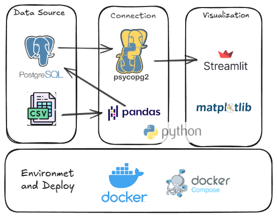

# 📊 Customer Churn Dashboard
An interactive data dashboard built with **Streamlit** to visualize 
customer churn data from a Postegres table. The app runs inside a **Docker container** 
and the Postegres database is in another container in a Docker network.




## Features

- Loads customer data from a CSV file to a Postegres table in one container Docker.
- Streamlit connect to Postegres database using psycopg2.
- Data transformation using Pandas and Matplotlib.
- Interactive dashboard using Streamlit.
- Displays churn distribution and monthly charges.
- Dockerized for easy deployment.
- Compatible with cloud environments like AWS

## Requirements

- Python 3.12
- Docker
- Streamlit
- psycopg2
- pandas
- matplotlib

## Running 

1. **Build the Docker image:**

```bash
docker compose build app --no-cache
```

2. **Build the Docker image:**
```bash
docker compose up
```

## Author
*Itaira S. F. Santos*